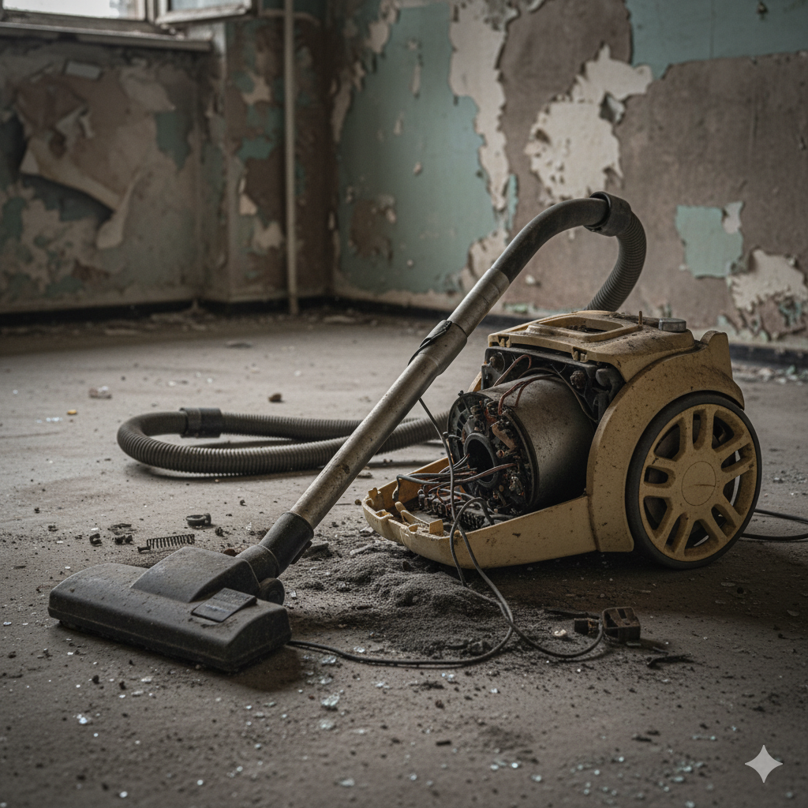

# E-401: Vacuum Cleaner Malfunction

## Error Code: E-401
**Category:** Mechanical Failure  
**Severity:** Medium  
**Estimated Resolution Time:** 15-30 minutes

---

## Symptoms

- Vacuum cleaner won't turn on or start
- Strange grinding or rattling noises during operation
- Loss of suction power
- Overheating and automatic shutoff
- Wheels not moving smoothly
- Brush roller not spinning

*Figure 1: Common vacuum cleaner malfunction indicators*

---

## Root Causes

1. **Clogged Filter or Dustbin**
   - Full dustbin blocking airflow
   - Dirty HEPA filter restricting air intake
   - Debris stuck in hose or attachments

2. **Belt Issues**
   - Worn or broken drive belt
   - Belt slipped off the roller
   - Incorrect belt tension

3. **Brush Roller Problems**
   - Hair and debris wrapped around roller
   - Damaged or worn bristles
   - Bearing failure in roller assembly

4. **Electrical Issues**
   - Blown thermal fuse
   - Faulty power switch
   - Damaged power cord
   - Motor burnout

5. **Blockages**
   - Hose obstruction
   - Intake port clog
   - Exhaust filter blockage

---

## Troubleshooting Steps

### Step 1: Check Power and Basic Operation
1. Verify the vacuum is plugged into a working outlet
2. Test outlet with another device to confirm power
3. Inspect power cord for visible damage or fraying
4. Check if the power switch clicks properly
5. Listen for any motor humming (indicates partial power)

**Expected Result:** Vacuum should power on with normal startup sound

---

### Step 2: Empty and Clean Dustbin
1. Remove dustbin/bag and empty completely
2. Clean dustbin with warm water and mild soap
3. Dry thoroughly before reinstalling
4. Check dustbin seal for damage
5. Ensure dustbin clicks securely into place

**Expected Result:** Improved airflow and suction power

*Figure 2: Inspect the dustbin area for clogs and ensure proper sealing*

---

### Step 3: Clean or Replace Filters
1. Locate all filters (pre-motor, post-motor, HEPA)
2. Remove filters according to user manual
3. For washable filters:
   - Rinse under cold water until water runs clear
   - Gently squeeze out excess water (don't wring)
   - Air dry completely for 24 hours before reinstalling
4. For non-washable filters:
   - Tap gently to remove loose dust
   - Replace if older than 3-6 months
5. Check filter housing for debris

**Expected Result:** Restored suction and reduced motor strain

---

### Step 4: Inspect and Clear Blockages
1. Disconnect power before inspection
2. Check main hose:
   - Detach hose from vacuum
   - Look through both ends for obstructions
   - Use a broom handle to push out blockages
3. Inspect intake port where hose connects
4. Check all attachments and tools for clogs
5. Examine exhaust vent for blockages

**Expected Result:** Clear airflow path throughout vacuum

---

### Step 5: Clean Brush Roller
1. Turn vacuum over to access brush roller
2. Remove brush roller cover (may require screwdriver)
3. Cut away hair and debris with scissors:
   - Work carefully to avoid cutting bristles
   - Remove all tangled material
4. Check for damaged or missing bristles
5. Inspect roller bearings for smooth rotation
6. Clean roller housing area
7. Reinstall brush roller and cover

**Expected Result:** Brush roller spins freely without obstruction

*Figure 3: Removing tangled debris from the brush roller*

---

### Step 6: Inspect Drive Belt
1. With brush roller removed, locate drive belt
2. Check belt condition:
   - Look for cracks, fraying, or stretching
   - Verify belt is on both pulleys properly
   - Check for correct tension (should have slight give)
3. If belt is damaged:
   - Note model number for replacement belt
   - Remove old belt
   - Loop new belt around motor shaft first
   - Stretch onto brush roller pulley
   - Ensure proper alignment
4. Rotate brush manually to test belt engagement

**Expected Result:** Belt is intact and properly tensioned

---

### Step 7: Test Operation
1. Reassemble all components securely
2. Ensure all covers and panels are properly closed
3. Plug in vacuum cleaner
4. Start on lowest setting first
5. Listen for unusual noises:
   - Grinding (bearing issue)
   - Whistling (air leak)
   - Rattling (loose component)
6. Test suction power on various surfaces
7. Check for overheating after 5 minutes of use

**Expected Result:** Normal operation with strong suction

---

## Resolution Success Criteria

✅ Vacuum powers on immediately  
✅ Strong, consistent suction power  
✅ Brush roller spins smoothly  
✅ No unusual noises during operation  
✅ No overheating after 10 minutes  
✅ Wheels roll smoothly  
✅ All attachments work properly

---

## When to Escalate

Escalate to Level 2 support if:
- Motor doesn't run despite having power
- Strong burning smell from motor
- Belt repeatedly breaks or slips off
- Excessive vibration or wobbling
- Suction remains weak after all cleaning steps
- Visible damage to motor housing or internal components
- Customer reports electric shock or sparking

---

## Prevention Tips

**For Customers:**
- Empty dustbin after each use or when 2/3 full
- Clean filters monthly (washable) or replace every 3-6 months
- Remove large debris before vacuuming
- Check brush roller for tangled hair weekly
- Store in dry location
- Don't vacuum liquids unless rated for wet use
- Avoid vacuuming hard objects (coins, screws, etc.)

**Maintenance Schedule:**
- **Weekly:** Empty dustbin, check brush roller
- **Monthly:** Clean washable filters, inspect hose
- **Quarterly:** Deep clean all components
- **Annually:** Replace drive belt, replace HEPA filter, professional service

---

## Related Error Codes
- **E-402:** Overheating Protection Activated
- **E-403:** Brush Motor Failure
- **E-404:** Suction Sensor Error

---

## Additional Resources
- User Manual: Device-specific maintenance procedures
- Replacement Parts: Filters, belts, brush rollers
- Video Tutorial: "Vacuum Cleaner Deep Cleaning Guide"
