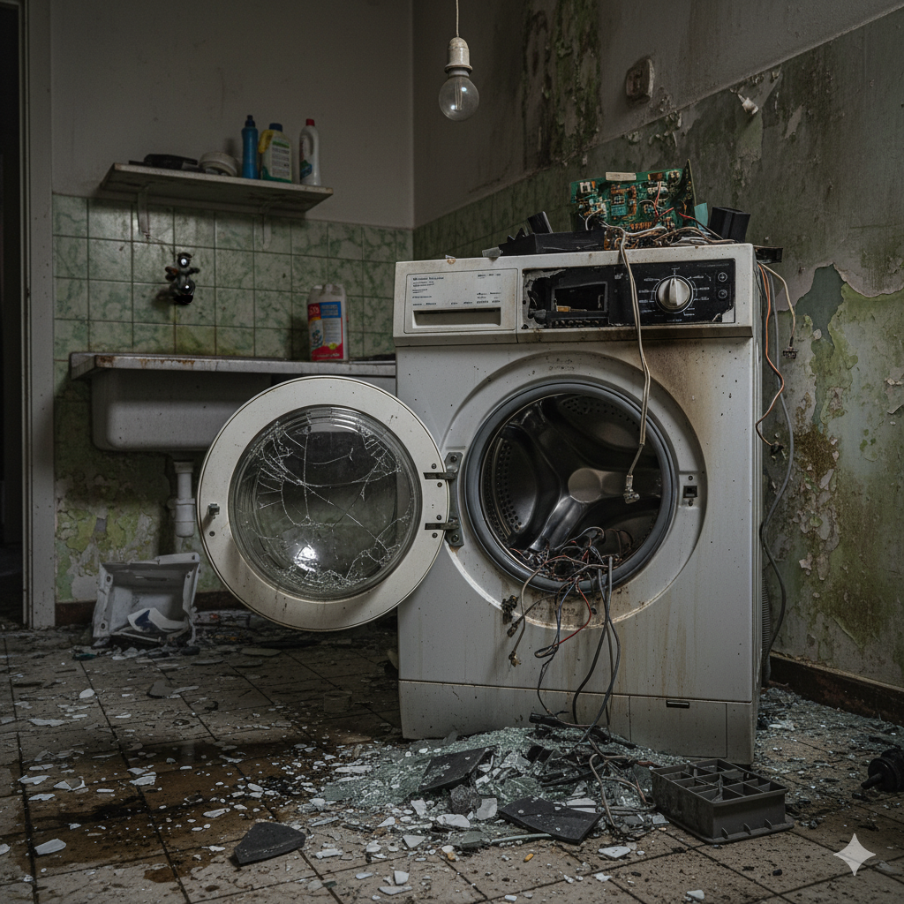

# E-501: Washing Machine Error

## Error Code: E-501
**Category:** Appliance Malfunction  
**Severity:** High  
**Estimated Resolution Time:** 20-45 minutes

---

## Symptoms

- Washing machine won't start or complete cycle
- Water not filling or draining properly
- Excessive vibration or shaking during spin cycle
- Door/lid won't lock or unlock
- Error code displayed on control panel
- Unusual noises (grinding, banging, squealing)
- Water leaking from machine
- Clothes remain wet after cycle

*Figure 1: Washing machine displaying error condition*

---

## Root Causes

1. **Water Supply Issues**
   - Closed or partially closed water valves
   - Kinked inlet hose
   - Clogged inlet filter screens
   - Low water pressure

2. **Drainage Problems**
   - Clogged drain pump filter
   - Blocked drain hose
   - Drain pump failure
   - Kinked or elevated drain hose

3. **Load Imbalance**
   - Uneven distribution of clothes
   - Overloaded drum
   - Single heavy item (comforter, rug)
   - Shipping bolts not removed (new machines)

4. **Door/Lid Lock Failure**
   - Faulty door lock mechanism
   - Misaligned door strike
   - Water still in drum preventing unlock
   - Electronic control board issue

5. **Mechanical Failures**
   - Worn drive belt
   - Failed motor or capacitor
   - Damaged suspension springs
   - Bearing failure

---

## Troubleshooting Steps

### Step 1: Verify Power and Basic Checks
1. Confirm machine is plugged in securely
2. Check circuit breaker hasn't tripped
3. Test outlet with another device
4. Ensure door/lid is fully closed
5. Check if any error codes are displayed
6. Turn machine off and on to reset

**Expected Result:** Machine powers on and displays normal status

---

### Step 2: Check Water Supply
1. Turn off power to machine
2. Locate water supply valves (usually behind machine)
3. Ensure both hot and cold valves are fully open
4. Inspect inlet hoses:
   - Look for kinks or damage
   - Feel for water flow when valve is open
5. Check inlet filter screens:
   - Turn off water valves
   - Disconnect inlet hoses from machine
   - Remove small mesh filters from inlet ports
   - Clean filters under running water
   - Reinstall filters and reconnect hoses
6. Turn water valves back on

**Expected Result:** Water flows freely into machine

*Figure 2: Inspecting water inlet connections and hoses*

---

### Step 3: Inspect Drain System
1. Turn off and unplug machine
2. Locate drain pump filter (usually front lower panel):
   - Place towels on floor to catch water
   - Open filter cover
   - Slowly unscrew filter (water will drain)
   - Remove debris, coins, buttons, lint
   - Clean filter thoroughly
   - Reinstall filter and cover
3. Check drain hose:
   - Disconnect from standpipe or sink
   - Look for clogs or kinks
   - Ensure hose end is not submerged in water
   - Verify hose height is correct (check manual)
4. Test drain pump:
   - Run drain/spin cycle
   - Listen for pump motor running
   - Check if water drains

**Expected Result:** Water drains completely from machine

---

### Step 4: Address Load Balance Issues
1. Open door/lid and redistribute clothes evenly
2. Check for overloading:
   - Remove some items if drum is packed tight
   - Drum should be no more than 3/4 full
3. For single heavy items:
   - Add 2-3 towels to balance load
   - Or wash heavy items alone on appropriate cycle
4. For new machines, check if shipping bolts were removed:
   - Look at rear of machine
   - Remove any remaining transit bolts
5. Ensure machine is level:
   - Use bubble level on top of machine
   - Adjust feet until level in all directions
   - Lock adjustment nuts once level

**Expected Result:** Machine runs smoothly without excessive vibration

*Figure 3: Checking drum for proper load distribution*

---

### Step 5: Door/Lid Lock Troubleshooting
1. If door won't close:
   - Check for clothing caught in seal
   - Inspect door gasket for damage
   - Ensure door strike aligns with lock
2. If door won't unlock after cycle:
   - Wait 2-3 minutes (safety lock delay)
   - Check if water remains in drum (drain first)
   - Try running drain/spin cycle
   - Unplug for 5 minutes to reset electronics
3. Manual door release (if equipped):
   - Locate manual release pull cord or lever
   - Usually near drain pump filter
   - Pull to mechanically release door
4. Inspect door lock mechanism:
   - Look for broken plastic components
   - Check wiring connections

**Expected Result:** Door locks securely when cycle starts, unlocks when complete

---

### Step 6: Check for Specific Error Codes
Common error codes and meanings:

- **E01/F01:** Water fill timeout - check water supply
- **E02/F02:** Drain timeout - check drain pump/hose
- **E03/F03:** Temperature sensor fault
- **E04/F04:** Water level sensor error
- **E05/F05:** Door lock fault
- **E09/F09:** Motor/drive fault

1. Note the exact error code displayed
2. Consult user manual for code-specific troubleshooting
3. Power off and reset by unplugging for 5 minutes
4. Try running diagnostic cycle if available (check manual)

**Expected Result:** Error code clears after addressing specific issue

---

### Step 7: Run Test Cycle
1. Ensure all previous steps completed
2. Add small, balanced load (few towels)
3. Select short wash cycle
4. Observe throughout cycle:
   - Water fills properly
   - Drum rotates smoothly
   - Water drains completely
   - Spin cycle operates
   - No unusual noises or vibration
   - Door unlocks when complete
5. Check clothes are properly cleaned and spun

**Expected Result:** Complete cycle with no errors

---

## Resolution Success Criteria

✅ Machine completes full wash cycle without errors  
✅ Water fills and drains properly  
✅ Minimal vibration during spin cycle  
✅ Door locks and unlocks correctly  
✅ No water leaks observed  
✅ Clothes are clean and properly spun  
✅ No unusual noises during operation

---

## When to Escalate

Escalate to professional service if:
- Persistent error codes after all troubleshooting
- Water leaking from bottom or back of machine
- Loud grinding or metal-on-metal sounds
- Drum doesn't rotate at all
- Burning smell from motor
- Control panel completely unresponsive
- Visible damage to drum, suspension, or structure
- Machine walks across floor despite being level
- Electrical issues (tripping breaker, sparking)

---

## Prevention Tips

**For Customers:**
- Use appropriate amount of HE detergent (if applicable)
- Don't overload the machine
- Check pockets for coins, keys, small objects
- Use mesh bags for delicates and small items
- Clean door gasket monthly to prevent mold
- Leave door open between uses to air dry
- Run cleaning cycle monthly with washing machine cleaner
- Use hot water cycle occasionally to prevent buildup

**Maintenance Schedule:**
- **Monthly:** Clean drain pump filter, wipe door gasket
- **Quarterly:** Run cleaning cycle, check hoses for wear
- **Annually:** Inspect all hoses and replace if showing signs of wear
- **Every 3-5 years:** Professional inspection of belts, motor, suspension

---

## Safety Warnings

⚠️ **Always unplug machine before servicing**  
⚠️ **Turn off water supply before disconnecting hoses**  
⚠️ **Drain pump filter may release water - use towels**  
⚠️ **Do not force door open when locked**  
⚠️ **Never overload machine beyond capacity**

---

## Related Error Codes
- **E-502:** Drain Pump Failure
- **E-503:** Motor Control Error
- **E-504:** Water Inlet Valve Fault
- **E-505:** Door Lock Malfunction

---

## Additional Resources
- User Manual: Model-specific error codes and cycles
- Replacement Parts: Inlet hoses, drain pump filter, door gasket
- Video Tutorial: "Washing Machine Maintenance Guide"
- Water Efficiency Tips: Optimize wash settings
