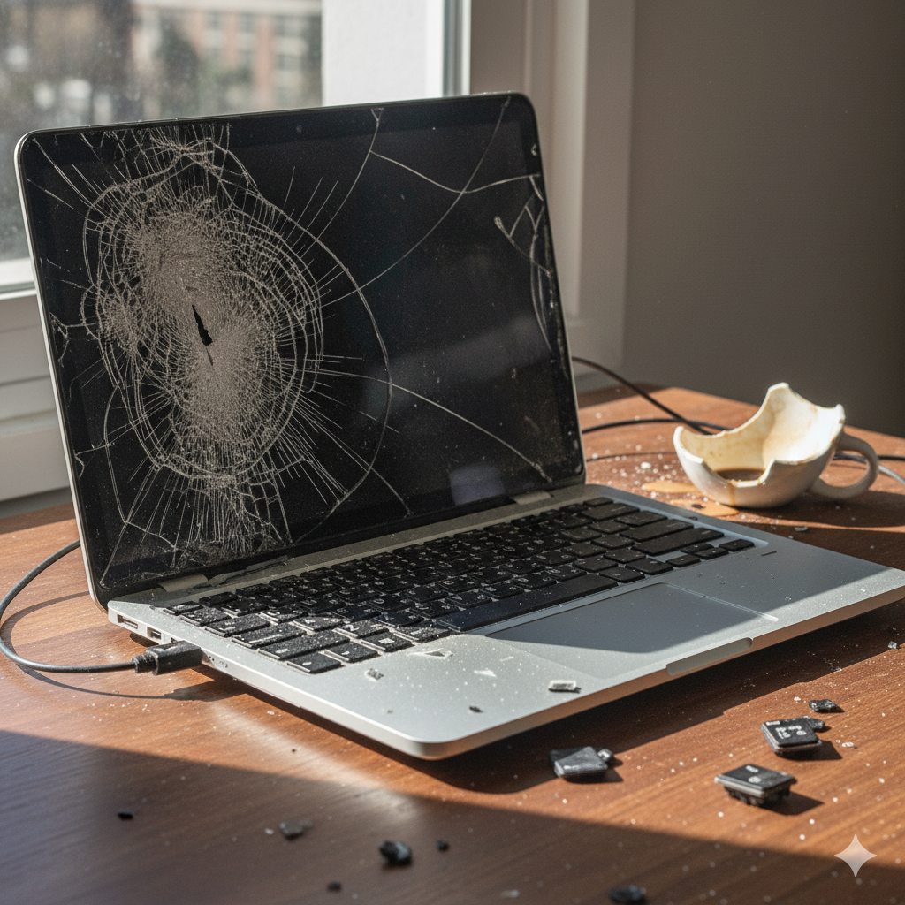

# E-601: Laptop Hardware Failure

## Error Code: E-601
**Category:** Computer Hardware Malfunction  
**Severity:** High  
**Estimated Resolution Time:** 30-60 minutes

---

## Symptoms

- Laptop won't power on or boot
- Screen remains black or displays artifacts
- Overheating and unexpected shutdowns
- Keyboard or trackpad not responding
- Battery not charging or holding charge
- Blue screen of death (BSOD) errors
- Unusual noises (clicking, grinding, whirring)
- USB ports or other connections not working
- WiFi or Bluetooth connectivity issues
- Extremely slow performance

*Figure 1: Laptop showing signs of hardware failure*

---

## Root Causes

1. **Power Issues**
   - Faulty AC adapter or charging cable
   - Dead or degraded battery
   - Damaged charging port
   - Power management circuit failure

2. **Display Problems**
   - Loose or damaged display cable
   - Failed LCD/LED panel
   - Graphics card/GPU failure
   - Backlight inverter issue

3. **Storage Failures**
   - Hard drive or SSD failure
   - Bad sectors on disk
   - Corrupted file system
   - Loose drive connections

4. **Memory (RAM) Issues**
   - Faulty RAM module
   - Unseated memory
   - Incompatible RAM upgrade
   - Memory slot failure

5. **Overheating**
   - Clogged cooling vents and fans
   - Dried thermal paste
   - Fan failure
   - Blocked air intake

6. **Peripheral Failures**
   - Keyboard membrane damage
   - Trackpad cable disconnect
   - USB port physical damage
   - WiFi card failure

---

## Troubleshooting Steps

### Step 1: Power and Battery Diagnostics
1. Disconnect AC adapter and remove battery (if removable)
2. Press and hold power button for 30 seconds (discharge residual power)
3. Reconnect AC adapter only (no battery)
4. Try to power on:
   - If it works: battery is likely the issue
   - If it doesn't: proceed to next checks
5. Check AC adapter:
   - Verify LED light on adapter brick is on
   - Test with multimeter if available (check voltage)
   - Try different outlet
   - Inspect cable for damage or fraying
6. Inspect charging port:
   - Look for physical damage or bent pins
   - Check for loose connection
   - Clean debris with compressed air

**Expected Result:** Laptop powers on with AC adapter

*Figure 2: Inspecting laptop power adapter and charging port*

---

### Step 2: Display Troubleshooting
1. Power on laptop and listen for startup sounds/fan
2. If laptop is running but screen is black:
   - Shine flashlight on screen at angle
   - If you can faintly see image: backlight issue
3. Test external display:
   - Connect external monitor via HDMI/DisplayPort
   - Press display toggle key (usually Fn + F4/F5/F8)
   - If external works: laptop display or cable issue
4. Check display settings:
   - Adjust brightness (Fn + brightness keys)
   - Ensure display isn't disabled in settings
5. Reseat display cable (advanced):
   - Power off and disconnect all power
   - Remove bezel and check cable connection
   - Reconnect firmly

**Expected Result:** Display shows BIOS screen or boot logo

---

### Step 3: Boot and Storage Diagnostics
1. If laptop powers on but won't boot:
   - Note any error messages or beep codes
   - Enter BIOS/UEFI (usually F2, Del, or F10 during boot)
   - Check if hard drive/SSD is detected in BIOS
2. Boot order check:
   - Ensure primary drive is set as first boot device
   - Disable unnecessary boot options
3. If drive is not detected:
   - Power off completely
   - Open bottom panel (consult manual)
   - Reseat hard drive or SSD connections
   - Check M.2 SSD is secured properly
4. Run built-in diagnostics:
   - Many laptops have diagnostic tools in BIOS
   - Run hard drive/SSD test
   - Note any failure codes
5. Boot from recovery media:
   - Create bootable USB with OS installer
   - Attempt to boot from USB
   - If successful: OS or drive corruption issue

**Expected Result:** Laptop boots to operating system

*Figure 3: Accessing internal components for hardware inspection*

---

### Step 4: Memory (RAM) Testing
1. If experiencing crashes, freezes, or won't boot:
   - Power off and disconnect all power
   - Open RAM access panel
   - Remove RAM modules
   - Clean contacts with isopropyl alcohol and soft cloth
   - Reseat firmly until clips click
2. If multiple RAM sticks:
   - Test one stick at a time
   - Try each stick in each slot
   - Identify faulty module or slot
3. Run memory diagnostic:
   - Windows: Windows Memory Diagnostic tool
   - Boot from USB: MemTest86+
   - Let run for at least one complete pass
   - Any errors indicate bad RAM

**Expected Result:** System stable with good RAM installed

---

### Step 5: Cooling System Maintenance
1. Check for overheating symptoms:
   - Laptop bottom extremely hot to touch
   - Unexpected shutdowns during use
   - Loud fan noise or fan not running
2. Clean cooling system:
   - Power off completely
   - Use compressed air on vents (short bursts)
   - Blow dust out of intake and exhaust vents
   - Remove bottom panel for deeper cleaning
   - Clean fan blades with cotton swabs
   - Check fan spins freely
3. Monitor temperatures:
   - Install monitoring software (HWMonitor, CoreTemp)
   - Normal temps: 40-60°C idle, 70-85°C under load
   - If over 90°C: cooling system needs service
4. Advanced: Thermal paste replacement
   - Remove heatsink (follow guide for your model)
   - Clean old paste with isopropyl alcohol
   - Apply new thermal paste (grain-of-rice amount)
   - Reinstall heatsink with proper tension

**Expected Result:** Laptop runs cool and doesn't throttle

---

### Step 6: Peripheral and Input Device Checks
1. Keyboard issues:
   - Test with external USB keyboard
   - Check for stuck keys or debris
   - Try keyboard function lock (Fn + Num Lock)
   - Update keyboard driver in Device Manager
2. Trackpad not working:
   - Check if accidentally disabled (Fn + trackpad key)
   - Test with external mouse
   - Update trackpad driver
   - Check cable connection (requires opening laptop)
3. USB ports:
   - Try multiple USB devices
   - Test all available ports
   - Check for physical damage
   - Update USB drivers and chipset drivers
4. WiFi issues:
   - Toggle WiFi on/off (Fn + WiFi key)
   - Check if WiFi card detected in Device Manager
   - Update WiFi drivers
   - Reseat WiFi card (requires opening laptop)

**Expected Result:** All input devices and ports functional

---

### Step 7: BIOS/Firmware Updates and Reset
1. Update BIOS to latest version:
   - Download from manufacturer's website
   - Follow instructions carefully (critical - don't interrupt)
   - Backup data before updating
2. Reset BIOS to defaults:
   - Enter BIOS setup
   - Find "Load Setup Defaults" or similar option
   - Save and exit
3. Remove CMOS battery (advanced):
   - Power off and disconnect everything
   - Open laptop and locate CMOS battery
   - Remove for 5 minutes
   - Reinstall and power on
4. Firmware updates:
   - Check for storage firmware updates
   - Update chipset and other device firmware

**Expected Result:** System stability improved with latest firmware

---

## Resolution Success Criteria

✅ Laptop powers on consistently  
✅ Display shows clear, normal image  
✅ Boots to operating system without errors  
✅ All input devices (keyboard, trackpad) working  
✅ USB and other ports functional  
✅ WiFi and Bluetooth connecting properly  
✅ No overheating or unexpected shutdowns  
✅ Battery charging normally  
✅ No unusual noises from fans or drives

---

## When to Escalate

Escalate to professional repair if:
- Laptop still won't power on after all checks
- Burning smell or visible component damage
- Liquid damage (even if dried)
- Cracked or shattered screen
- Hard drive clicking or grinding sounds (backup data immediately)
- Motherboard or GPU failure suspected
- Battery swelling or deformation
- Repeated BSODs with hardware error codes
- Physical damage from drops or impacts
- Data recovery needed from failed drive

---

## Prevention Tips

**For Customers:**
- Use on hard, flat surfaces for proper airflow
- Clean vents monthly with compressed air
- Don't block air intakes or exhausts
- Use surge protector or UPS
- Don't leave plugged in at 100% constantly
- Shut down properly (don't force power off)
- Keep liquids away from laptop
- Use laptop bag or sleeve for transport
- Update drivers and firmware regularly
- Backup important data regularly

**Maintenance Schedule:**
- **Monthly:** Clean vents, check for software updates
- **Quarterly:** Full external cleaning, driver updates
- **Annually:** Internal cleaning, thermal paste replacement (if needed)
- **Every 2-3 years:** Battery replacement (if not holding charge)
- **As needed:** Professional service for deep cleaning

---

## Safety Warnings

⚠️ **Disconnect all power before opening laptop**  
⚠️ **Ground yourself to prevent static discharge**  
⚠️ **Do not force connections or components**  
⚠️ **BIOS updates can brick system if interrupted**  
⚠️ **Keep warranty stickers intact if under warranty**  
⚠️ **Do not attempt liquid damage repair yourself**

---

## Common Error Messages

| Error | Meaning | Solution |
|-------|---------|----------|
| "No Boot Device" | Drive not detected | Check connections, BIOS settings |
| "Operating System Not Found" | Boot sector corruption | Repair boot sector or reinstall OS |
| "CMOS Battery Failure" | CMOS battery dead | Replace CMOS battery |
| "Thermal Event" | Overheating detected | Clean cooling system |
| "Memory Error" | RAM failure | Test and replace RAM |

---

## Related Error Codes
- **E-602:** Display Hardware Failure
- **E-603:** Storage Device Error
- **E-604:** Memory Test Failure
- **E-605:** Overheating Protection Activated

---

## Additional Resources
- Manufacturer Support: Model-specific service manuals
- Diagnostic Tools: Built-in hardware diagnostics
- Driver Updates: Manufacturer and chipset vendor websites
- Community Forums: Model-specific troubleshooting discussions
