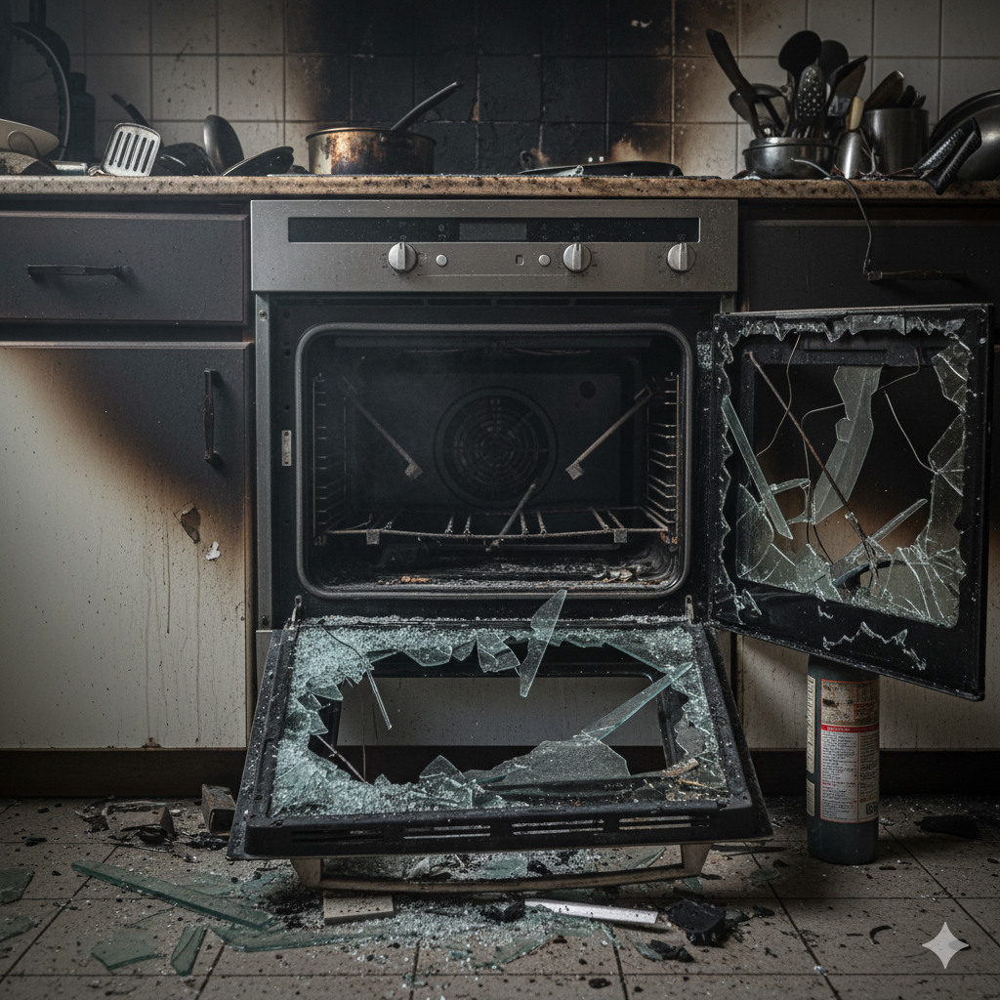

# E-701: Oven Heating Problem

## Error Code: E-701
**Category:** Kitchen Appliance Malfunction  
**Severity:** High  
**Estimated Resolution Time:** 25-45 minutes

---

## Symptoms

- Oven not heating at all
- Oven heating slowly or not reaching set temperature
- Uneven heating (hot spots or cold zones)
- Temperature significantly different from setting
- Oven overheating or burning food
- Error codes on display panel
- Gas smell (for gas ovens)
- Electric element not glowing (electric ovens)
- Preheating takes much longer than normal
- Broiler not working

*Figure 1: Oven displaying heating malfunction*

---

## Root Causes

### For Electric Ovens:
1. **Heating Element Failure**
   - Burned out bake element (bottom)
   - Failed broil element (top)
   - Element with visible breaks or blisters

2. **Temperature Sensor Issues**
   - Faulty oven temperature sensor (RTD probe)
   - Sensor touching oven wall
   - Disconnected or damaged sensor wiring

3. **Control Board Problems**
   - Failed electronic control board
   - Relay failure on control board
   - Incorrect calibration

4. **Wiring Issues**
   - Loose or corroded connections
   - Damaged internal wiring
   - Blown thermal fuse

### For Gas Ovens:
1. **Igniter Problems**
   - Weak or failed igniter
   - Igniter not glowing at all
   - Insufficient current draw

2. **Gas Flow Issues**
   - Gas valve not opening
   - Clogged burner ports
   - Low gas pressure
   - Gas supply turned off

3. **Safety Valve Failure**
   - Stuck or failed safety valve
   - Thermal fuse blown

---

## Troubleshooting Steps

### Step 1: Basic Checks and Safety
1. **For all ovens:**
   - Ensure oven is plugged in (or circuit breaker on)
   - Check if clock/display is working
   - Verify oven is not in Sabbath mode or demo mode
   - Cancel any timers or locks
   - Reset by unplugging for 1 minute

2. **For gas ovens ONLY:**
   - ⚠️ **SAFETY FIRST:** If you smell gas, do NOT use the oven
   - Turn off gas supply immediately
   - Open windows for ventilation
   - Call gas company or professional service
   - DO NOT attempt repair if gas leak suspected

3. **For electric ovens:**
   - Check circuit breaker hasn't tripped
   - Verify oven is on dedicated 240V circuit
   - Check for error codes on display

**Expected Result:** Power confirmed, no gas leaks

*Figure 2: Checking oven control panel and settings*

---

### Step 2: Temperature Sensor Inspection (Electric & Gas)
1. Locate temperature sensor:
   - Usually inside oven cavity at top rear
   - Thin metal probe, about 1-2 inches long
   - Connected by wires through back wall
2. Visual inspection:
   - Check if sensor is touching oven wall
   - Should be isolated from walls (gap of 1/8 inch)
   - Look for visible damage or corrosion
   - Ensure mounting bracket is secure
3. Test sensor resistance (requires multimeter):
   - Disconnect power/gas
   - Remove sensor (usually one screw)
   - Set multimeter to ohms
   - Test sensor at room temp (should read ~1000-1100 ohms)
   - If reading is far off or infinite: sensor failed
4. Check sensor wiring:
   - Inspect wires for damage
   - Ensure connectors are secure
   - Look for burn marks or melted insulation

**Expected Result:** Sensor properly positioned and functioning

---

### Step 3: Heating Element Check (Electric Ovens Only)
1. **Visual inspection:**
   - Set oven to 350°F (175°C)
   - Watch bake element (bottom):
     - Should glow red within 1-2 minutes
     - Glowing should be even across element
   - Check broil element (top) on broil setting
   
2. **Look for element damage:**
   - Blisters or bubbles on element surface
   - Visible breaks or separations
   - Holes burned through element
   - Dark spots or discoloration

3. **Test element continuity (power OFF):**
   - Disconnect power at breaker
   - Remove element (slides or screws)
   - Use multimeter on ohms setting
   - Bake element should read: 15-50 ohms
   - Broil element should read: 20-80 ohms
   - Infinite reading = element is bad

4. **Inspect element connections:**
   - Check terminals for burn marks
   - Ensure wires are securely attached
   - Look for corrosion on connectors

**Expected Result:** Elements glow evenly and have proper resistance

*Figure 3: Inspecting electric heating element for damage*

---

### Step 4: Igniter and Gas Valve Check (Gas Ovens Only)
1. **Igniter observation:**
   - Set oven to bake at 350°F
   - Open door slightly to observe igniter
   - Igniter should glow bright orange/white within 90 seconds
   - After ~30-90 seconds of glowing, gas should ignite
   
2. **Igniter glow test:**
   - **Bright white/orange glow + gas ignites:** Igniter OK
   - **Glows but gas doesn't ignite:** Weak igniter (replace)
   - **Glows dim orange/red:** Weak igniter (replace)
   - **No glow at all:** Failed igniter or no power

3. **Gas valve check:**
   - If igniter glows properly but no gas:
     - Check gas supply valve is fully open
     - Verify other gas appliances work
     - Listen for gas valve click (may need to be quiet)
   - Gas valve failure requires professional repair

4. **Burner inspection:**
   - Turn off gas supply
   - Remove oven racks
   - Inspect burner ports for blockage
   - Clean any debris with soft brush
   - Ensure burner is properly positioned

**Expected Result:** Igniter glows bright and gas ignites within 90 seconds

---

### Step 5: Oven Calibration Test
1. **Temperature verification:**
   - Place oven thermometer on center rack
   - Set oven to 350°F
   - Allow to preheat fully (listen for indicator)
   - Wait 15 minutes for temperature to stabilize
   - Check thermometer reading

2. **Temperature deviation:**
   - Within ±25°F (14°C): Normal, may calibrate
   - 25-50°F (14-28°C) off: Calibration needed
   - More than 50°F (28°C) off: Sensor or control issue

3. **Calibration adjustment (if supported):**
   - Consult user manual for calibration procedure
   - Usually done through control panel settings
   - Typical range: ±35°F adjustment
   - Make 5-10°F adjustments, test again

4. **Multi-point test:**
   - Test at different temps (300°F, 375°F, 425°F)
   - Document actual vs. set temperature
   - Pattern helps diagnose sensor vs. element issues

**Expected Result:** Oven reaches and maintains correct temperature

*Figure 4: Using oven thermometer to verify temperature accuracy*

---

### Step 6: Control Board and Display Issues
1. **Error code interpretation:**
   - Note exact error code on display
   - Consult user manual for meaning
   - Common codes:
     - F1, F2, F3: Temperature sensor errors
     - F7, F8: Function key stuck
     - F9: Door lock fault (self-clean models)
     - F10: Runaway temperature

2. **Control board reset:**
   - Turn off circuit breaker for 1 minute
   - Or unplug oven for 1 minute
   - Restore power
   - Try operating oven

3. **Inspect control board (advanced):**
   - ⚠️ **Disconnect all power first**
   - Remove control panel cover
   - Look for:
     - Burned components
     - Loose wire connections
     - Corrosion on circuit board
     - Blown fuses on board
   - Do NOT touch components if under warranty

4. **Button and touchpad test:**
   - Test all control buttons
   - Check for stuck keys
   - Ensure touchpad responds properly
   - Clean with appropriate cleaner if sticky

**Expected Result:** Control board responds properly, no error codes

---

### Step 7: Final System Test
1. Clean oven interior:
   - Remove all racks, thermometers, foil
   - Wipe down interior
   - Ensure no debris on elements/burner
2. Perform complete preheat cycle:
   - Set to 350°F
   - Monitor time to preheat
   - Should complete in 12-18 minutes
3. Temperature hold test:
   - Let oven run for 30 minutes
   - Check if temperature stays stable
   - Monitor for unexpected shutoffs
4. Function test:
   - Test bake mode
   - Test broil mode
   - Test convection (if equipped)
5. Oven light test:
   - Ensure interior light works
   - Replace bulb if needed (oven-rated bulb only)

**Expected Result:** All functions work normally

---

## Resolution Success Criteria

✅ Oven heats to set temperature within normal time  
✅ Temperature accurate within ±25°F of setting  
✅ Even heating throughout oven cavity  
✅ All modes (bake, broil, convection) working  
✅ No error codes displayed  
✅ No gas smell (gas ovens)  
✅ Elements/igniter functioning properly  
✅ Maintains temperature without cycling on/off excessively

---

## When to Escalate

Escalate to professional appliance repair if:
- **Gas oven:** Any gas smell or suspected gas leak
- **Gas oven:** Igniter replacement needed (requires gas line work)
- Control board needs replacement
- Gas valve failure
- Wiring damage inside oven walls
- Consistent error codes after all troubleshooting
- Oven heating above set temperature (runaway temp)
- Self-clean door lock mechanism failure
- Any uncertainty about electrical or gas repairs

⚠️ **Never attempt gas line work without proper training and licensing**

---

## Prevention Tips

**For Customers:**
- Clean spills immediately to prevent buildup
- Use oven liner on bottom (not covering vents)
- Don't use foil to line racks or walls
- Verify temperature with oven thermometer monthly
- Self-clean mode: Use only when needed (hard on components)
- Don't slam oven door
- Keep vent openings clear
- Use proper cookware (avoid warped pans)

**Maintenance Schedule:**
- **Monthly:** Wipe interior, check door seal
- **Quarterly:** Deep clean, check element condition, verify temperature
- **Annually:** Professional inspection for gas ovens
- **Every 2-3 years:** Replace oven light bulb as needed
- **As needed:** Recalibrate temperature

---

## Safety Warnings

⚠️ **DISCONNECT POWER before any electrical work**  
⚠️ **GAS SMELL: Turn off gas, ventilate, call professional immediately**  
⚠️ **High voltage: 240V for electric ovens - extreme caution**  
⚠️ **Hot surfaces: Allow oven to cool completely before service**  
⚠️ **Self-clean cycle: Removes air - ventilate kitchen**  
⚠️ **Do not bypass safety fuses or interlocks**  
⚠️ **Gas repairs: Licensed professional only**

---

## Related Error Codes
- **E-702:** Oven Temperature Sensor Failure
- **E-703:** Heating Element Burnout
- **E-704:** Gas Ignition Failure
- **E-705:** Control Board Malfunction

---

## Additional Resources
- User Manual: Model-specific calibration procedures
- Replacement Parts: Heating elements, temperature sensors, igniters
- Video Tutorial: "Oven Temperature Calibration Guide"
- Safety Information: Gas appliance safety guidelines
